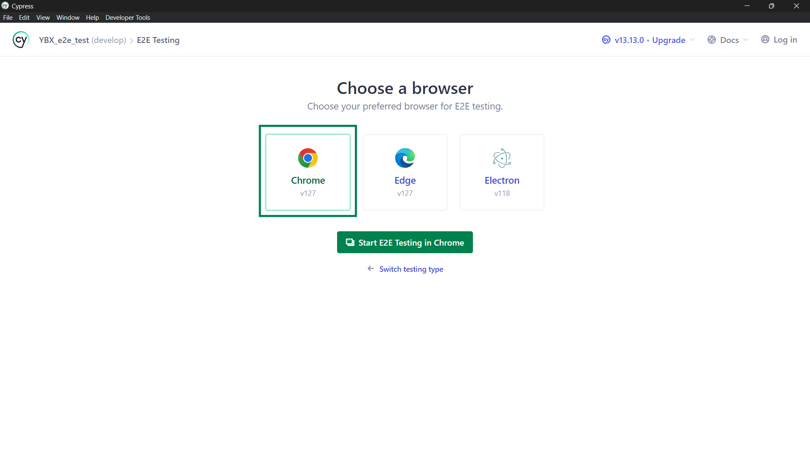
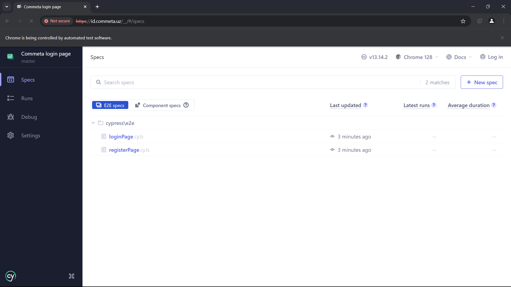
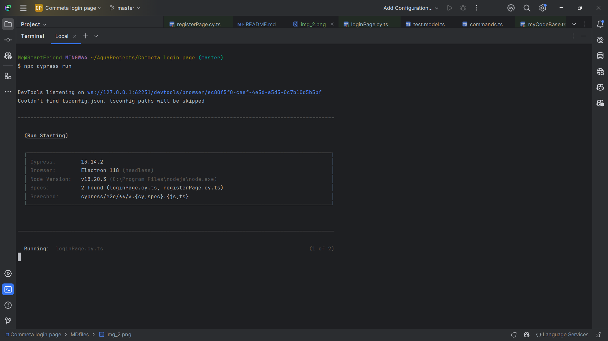

# This is a simple project to test the id.commeta.uz using Cypress.
### Code is written in JavaScript and uses Cypress for end-to-end testing.

## To start the project
**!IMPORTANT: Make sure you have installed Node.js and npm on your machine.**

### Step 1:

###### #clone my repo and enter into the directory

    git clone https://github.com/SarvarVakhobov/CommetaTest.git
    cd CommetaTest/

### Step 2:

###### #install npm

    npm install

### Step 3:

###### #open & configure Cypress

    npx cypress open

#### After running the command, you will see the Cypress browser main page. You should choose "E2E testing"

#### Then you will see some browsers like Chrome, Edge, Firefox (which your pc has).

You should click any browser to start testing.

On next stage, you will see the list of tests. You should click any file to test.

### Step 4:

###### #run the test

    npx cypress run

#### This is the command to run the test in the terminal. After running the command, you will see the test results in the terminal.

